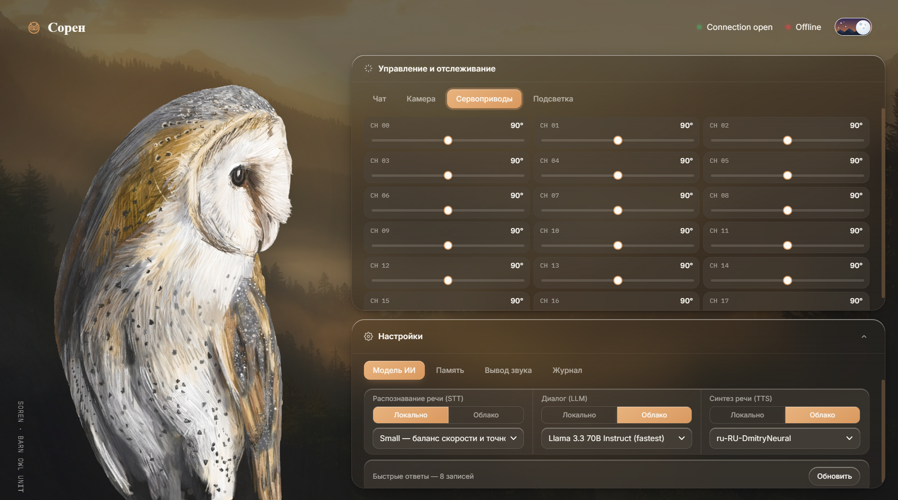

<div align="center">

# 🦉 AI Robot Server — Сорен

**Локальный AI-сервер для роботизированной совы на ESP32-S3**
Голосовое управление · Компьютерное зрение · 18 сервоприводов

<p align="center">
  
</p>

[](#требования)
[](#технологический-стек)
[](./LICENSE)
[](#требования)

</div>

---

## О проекте

**Сорен** — амбарная сова, cтраж Великого Древа Га'Хула из книг Кэтрин Ласки «Легенды ночных стражей», воплощённая в виде физического робота на базе **ESP32-S3**. Этот репозиторий — серверная часть проекта: локальный AI-сервер, который распознаёт речь, генерирует ответы в характере персонажа, синтезирует голос и управляет 18 сервоприводами робота в реальном времени.

Проект объединяет полный voice AI pipeline (STT → LLM → TTS), компьютерное зрение и физическое поведение робота в единую систему с веб-панелью управления.

### Ключевые возможности

- 🎙️ **Голосовой диалог** — распознавание речи, генерация ответа персонажа, синтез голоса
- 🧠 **LLM-персонаж с памятью** — Qwen 7B (дообученный на датасете персонажа) + векторная память (Qdrant) + RAG по биографии и миру Сорена
- 👁️ **Компьютерное зрение** — детекция объектов (YOLOv8), трекинг позы и лиц (MediaPipe/OpenCV)
- 🎭 **Эмоциональный движок** — 7 эмоциональных состояний с уникальными позами сервоприводов и подсветкой глаз
- 🔀 **Local / Cloud переключение** — каждый AI-модуль (STT, LLM, TTS) можно переключать между локальным инференсом и облачным API одной кнопкой
- 🦾 **Управление 18 сервоприводами** — голова, крылья, тело, хвост, лапы, глаза
- 🌐 **Веб-панель управления** — голосовой и текстовый чат, ручное управление сервоприводами, переключение режимов, анимации

---

## Демонстрация переключения Local / Cloud

Каждый AI-модуль имеет независимую кнопку переключения режима — удобно для баланса между приватностью/офлайн-работой и качеством/скоростью.

| Модуль     | Локально                   | Облачно                         |
| ---------- | -------------------------- | ------------------------------- |
| **STT** 🎤 | faster-whisper (~500 МБ)   | —                               |
| **LLM** 🧠 | Qwen 2.5 7B GGUF (~4.5 ГБ) | GitHub Models API (gpt-4o-mini) |
| **TTS** 🔊 | Silero (~120 МБ)           | edge-tts (Microsoft, бесплатно) |

---

## Технологический стек

`FastAPI` · `faster-whisper` · `llama-cpp-python` · `PyTorch / Silero` · `edge-tts` · `YOLOv8` · `MediaPipe` · `OpenCV` · `webrtcvad` · `Qdrant`

| Компонент               | Технология                                    | Назначение                       |
| ----------------------- | --------------------------------------------- | -------------------------------- |
| WebSocket / HTTP сервер | FastAPI + Uvicorn + websockets                | API для ESP32 и веб-панели       |
| STT (речь → текст)      | faster-whisper                                | Распознавание речи (локально)    |
| LLM (языковая модель)   | llama-cpp-python / GitHub Models API          | Генерация ответов Сорена         |
| TTS (текст → речь)      | Silero (PyTorch) / edge-tts                   | Синтез голоса                    |
| Долгосрочная память     | Qdrant (векторная БД)                         | Память диалогов и контекста      |
| Vision                  | Ultralytics YOLOv8 + MediaPipe + OpenCV       | Детекция объектов, позы, лиц     |
| Audio VAD               | webrtcvad                                     | Определение начала/конца речи    |
| Fine-tuning             | PEFT (LoRA/QLoRA) + Transformers + Accelerate | Дообучение LLM на персонаже      |
| Аудиообработка          | soundfile + librosa                           | Конвертация форматов, ресемплинг |
| Конфигурация            | python-dotenv                                 | Переменные окружения             |

---

## Архитектура

```
ESP32-S3 (робот) ──WebSocket──▶  FastAPI-сервер  ──▶  STT → LLM → TTS
     ▲   18 сервоприводов              │
     │   микрофон / динамик            ├──▶ Vision (YOLOv8, MediaPipe)
     │   камера                        ├──▶ Эмоциональный движок → позы сервоприводов
     └──────────── аудио/команды ◀─────┴──▶ Веб-панель управления (/panel)
```

---

## Быстрый старт

### 1. Установка зависимостей

```bash
python -m venv venv
venv\Scripts\activate      # Windows
source venv/bin/activate   # Linux / macOS

pip install -r requirements.txt
```

### 2. Настройка конфигурации

```bash
cp .env.example .env
# укажи GITHUB_MODELS_KEY в .env, если нужен облачный LLM
```

### 3. Загрузка моделей

```bash
python download_qwen.py   # LLM — Qwen 7B GGUF
python download_yolo.py   # Vision — YOLOv8
# Whisper и Silero скачаются автоматически при первом запуске
```

### 4. Запуск сервера

```bash
python websocket_server.py
```

Панель управления будет доступна по адресу: **http://localhost:8765/panel**

---

## Веб-панель управления

Панель (`/panel`) объединяет всё управление роботом в одном интерфейсе:

- Переключение режимов **Local / Cloud** для STT, LLM и TTS
- Переключение аудио-ввода (микрофон) и аудио-вывода (динамик)
- Голосовой чат и текстовый чат с Сореном
- Запуск анимаций: `wave`, `nod`, `shake_head`, `idle`
- Ручное управление каждым из 18 сервоприводов
- Отображение текущего статуса сервера и AI-модулей

---

## Персонаж Сорен

### Память и знания (RAG)

База знаний персонажа включает биографию, отношения с ключевыми персонажами, лор мира Га'Хула и философию — используется для контекстно-точных ответов в характере персонажа. Долгосрочная память диалогов хранится в векторной БД Qdrant.

---

## Аппаратная часть

Прошивка ESP32-S3 (`esp32_ai_robot_server.ino`) подключается к серверу по WebSocket (`/ws`, порт 8765), стримит аудио с микрофона и видео с камеры, принимает аудио-ответы и команды на сервоприводы, автоматически переподключается и восстанавливает прерванную фразу после обрыва Wi-Fi.

**Электроника:** ESP32-S3 (PSRAM) · PCA9685 (16-канальный I2C PWM-драйвер) · 18 сервоприводов · INMP441 (I2S-микрофон) · OV2640 (камера) · динамик с усилителем MAX98357A (I2S) · адресная LED-лента (подставка)

### Сервоприводы (18 каналов, индексы 0–17)

16 каналов идут через **PCA9685** (I2C, адрес `0x40`, 50 Гц, шина на GPIO 4/5), ещё 2 — напрямую с ESP32-S3 через LEDC PWM (50 Гц, 16 бит):

| Индекс | Имя               | Назначение                 | Канал   |
| ------ | ----------------- | -------------------------- | ------- |
| 0      | `L_FLAP`          | Левое крыло — взмах        | PCA9685 |
| 1      | `L_FOLD`          | Левое крыло — складывание  | PCA9685 |
| 2      | `R_FLAP`          | Правое крыло — взмах       | PCA9685 |
| 3      | `R_FOLD`          | Правое крыло — складывание | PCA9685 |
| 4      | `WING_TILT`       | Наклон крыльев (общий)     | PCA9685 |
| 5      | `L_LEG_TURN`      | Левая нога — поворот       | PCA9685 |
| 6      | `L_LEG_FOLD`      | Левая нога — сгиб          | PCA9685 |
| 7      | `L_LEG_LIFT`      | Левая нога — подъём        | PCA9685 |
| 8      | `R_LEG_TURN`      | Правая нога — поворот      | PCA9685 |
| 9      | `R_LEG_FOLD`      | Правая нога — сгиб         | PCA9685 |
| 10     | `R_LEG_LIFT`      | Правая нога — подъём       | PCA9685 |
| 11     | `TAIL_YAW`        | Хвост — поворот            | PCA9685 |
| 12     | `TAIL_SPREAD`     | Хвост — раскрытие          | PCA9685 |
| 13     | `TAIL_LIFT`       | Хвост — подъём             | PCA9685 |
| 14     | `HEAD_YAW`        | Голова — влево/вправо      | PCA9685 |
| 15     | `HEAD_PITCH`      | Голова — вперёд/назад      | PCA9685 |
| 16     | `HEAD_ROLL_INDEX` | Голова — крен вбок         | GPIO 38 |
| 17     | `BEAK_INDEX`      | Открытие клюва             | GPIO 39 |

Углы сервоприводов сглаживаются интерполяцией (шаг ≤4°, каждые 10 мс), чтобы движения выглядели плавно, а не рывками.

### Аудио (I2S)

| Узел      | Роль                   | Пины (BCLK / WS·LRC / DATA) | Частота дискретизации |
| --------- | ---------------------- | --------------------------- | --------------------- |
| INMP441   | Микрофон (RX)          | GPIO 1 / 3 / 2              | 16 кГц                |
| MAX98357A | Усилитель/динамик (TX) | GPIO 40 / 41 / 42           | 48 кГц                |

Динамик работает через кольцевой буфер в PSRAM с джиттер-буфером (~125 мс) и fade-in каждой новой фразы; во время воспроизведения и 400 мс после микрофон программно глушится, чтобы не ловить эхо.

### Камера (OV2640)

Данные: D0–D7 → GPIO 11, 9, 8, 10, 12, 18, 17, 16 · PCLK → GPIO 13 · VSYNC → GPIO 6 · HREF → GPIO 7 · SIOD/SIOC (I2C) → GPIO 14/21 · RESET → GPIO 15. Разрешение QVGA (320×240), адаптивный FPS: 3 кадра/с в режиме ожидания, 15 кадров/с при обнаруженном лице/активном диалоге.

### Подсветка подставки

Адресная LED-лента (NeoPixel, 60 светодиодов) на GPIO 47 — тёплая белая подсветка с плавной анимацией включения/выключения, управляется командой `backlight` с сервера.

### Сеть и связь

ESP32-S3 подключается к Wi-Fi и держит постоянное WebSocket-соединение с сервером (heartbeat каждые 30 с, таймаут 60 с, автопереподключение раз в 5 с). При обрыве связи во время озвучки фраза запрашивается заново после восстановления соединения.

---

## API

| Endpoint      | Метод | Описание                             |
| ------------- | ----- | ------------------------------------ |
| `/`           | GET   | Статус сервера                       |
| `/status`     | GET   | Полный статус и режимы AI-модулей    |
| `/audio_mode` | POST  | Переключение аудио (вход/выход)      |
| `/ai_mode`    | POST  | Переключение AI-модуля (stt/tts/llm) |
| `/speak`      | POST  | Текст → LLM → TTS → аудио            |
| `/voice`      | POST  | Аудио → STT → LLM → TTS → аудио      |
| `/panel`      | GET   | Веб-панель управления (HTML)         |
| `/ws`         | WS    | WebSocket-канал для ESP32            |

---

## Тестирование

```bash
python check_model.py    # Проверка целостности LLM-модели
python test_server.py    # Тест сервера без физического ESP32
python test_github.py    # Тест GitHub Models API
python test_all.py       # Полное тестирование всех модулей
```

---

## Требования

- **Python:** 3.10 – 3.11
- **ОЗУ:** от 8 ГБ (для локального Qwen 7B)
- **Диск:** ~5 ГБ под модели
- **ОС:** Windows 10/11, Linux, macOS

---

## Структура проекта

```
robot_server/
├── websocket_server.py      # Главный WebSocket-сервер + веб-панель
├── requirements.txt
├── .env.example
├── config/                  # Настройки сервера, AI, сервоприводов, анимаций
├── modules/                 # AI-модули: stt, tts, llm, vision, robot_brain,
│                             #   servo_controller, audio_buffer, fuzzy_matcher, memory
├── character/                # System prompt, RAG-чанки, карта эмоций Сорена
├── models/                   # AI-модели (скачиваются автоматически)
├── scripts/                  # Загрузка/подготовка моделей, датасета, fine-tuning
└── static/panel/              # Ассеты веб-панели
```

---

## Лицензия

Проект распространяется под лицензией **[MIT](./LICENSE)**.
